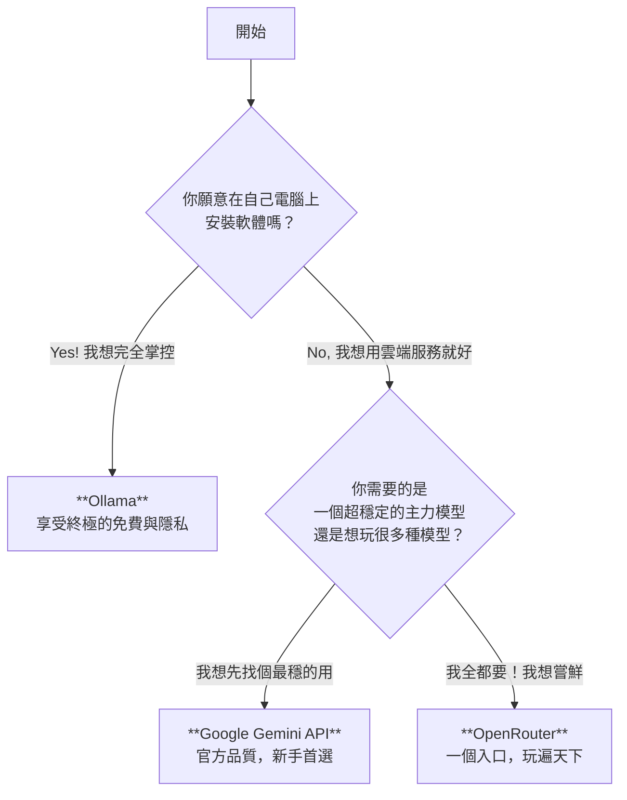

<div class="iframe-wrapper">
  <iframe 
    src="https://gamma.app/embed/0ahrf2quadlbv72" 
    title="Google Gems 完全解析：打造可分享的專屬 AI 助理" 
    allow="fullscreen">
  </iframe>
</div>

你是不是也想打造自己的 AI 小助理，卻被那些複雜的 API 定價搞得一個頭兩個大？別擔心，你不是一個人。很多人一聽到「API」、「Token」、「Rate Limit」這些詞就想關掉視窗。

但如果我告訴你，踏入 AI 世界的門票，很多時候是... 免費的呢？ 🚀

今天，這篇文章不跟你談那些遙遠的商業理論。我們就來當個聰明的「尋寶獵人」，我會把這張 2025 年最新的【免費 AI / GPT API 藏寶圖】攤開來，帶你一步步解析，找到最適合你的那條路。

## 首先，搞懂遊戲規則：免費的午餐有幾種吃法？

在我們深入探索之前，你得先知道，市面上的免費 API 大致可以分成三大家族，就像自助餐、美食街和自家廚房的差別。

### 第一種：🟢 官方豪門自助餐 (Official APIs)

這就像直接到 Google、Microsoft 這些豪門品牌的餐廳裡，他們會給你一張「試吃券」。菜色頂級、品質穩定，但試吃券總有用完的時候。非常適合想體驗原廠風味、專案剛起步、或是需要最高品質模型的你。

### 第二種：🟠 萬能美食街 (Third-party Aggregators)

想像一個超大的美食廣場，裡面有幾十個攤位，從開源的 LLaMA 到小眾的特化模型應有盡有。你只需要一張「美食卡」(例如 OpenRouter)，就能到處點餐。這裡的優點是選擇超級多，可以到處比較，找到性價比最高的模型組合。

### 第三種：🔵 自家小廚房 (Open Source & Self-hosted)

這條路，等於是把食譜跟廚具全給你，讓你回家自己煮！完全免費，愛怎麼煮就怎麼煮，沒有人會限制你。唯一的成本，就是你的「電腦硬體」和「學習時間」。但一旦學會，你就擁有了一位 7x24 小時待命、完全屬於你的 AI 廚師。

好，規則懂了？那我們的尋寶之旅正式開始！

## 🟢 第一站：官方豪門自助餐 — 品質與穩定的代名詞

### Google Gemini API：新手村的最佳夥伴 🌟

如果你是學生、剛入門的開發者，或者只是想做個有趣的小玩具，答應我，從這裡開始。

**為什麼它這麼棒？**
Google 提供的免費額度，說實話，慷慨到有點誇張。

> 每日 1,500 次請求
> 每分鐘 100 萬 Token

這數字可能有點抽象，我換個方式說：這大概等於你每天可以跟 AI 寫完半本小說，而且完全免費。它還支援多模態，也就是說，你可以丟圖片、影片給它看，跟它聊。

> **一句話總結：** 官方出品、穩定、大方，是你踏入 AI 開發世界最平坦的第一步路。

### 其他官方選擇：各具特色的高手們

**Anthropic Claude API：文組生的最愛**
Claude 以高品質的對話和寫作能力聞名，如果你需要的是一個強大的寫作助理或創意夥伴，它提供的約 $10 美金免費體驗金，絕對值得一試。

**Microsoft Azure / Copilot Studio：企業級的敲門磚**
如果你身在企業，想說服老闆導入 AI，Azure 提供的 $200 美金試用金，就是你最好的「概念驗證 (PoC)」工具。管道官方，安全嚴謹，老闆最放心。

**xAI Grok & Perplexity API：知識探索的利器**
這兩者更偏向於「即時資訊」與「知識搜尋」。Grok 搭配 OpenRouter 有更多免費額度；Perplexity 則能幫你打造需要即時網路資訊的學術或搜尋應用。

## 🟠 第二站：萬能美食街 — 模型多到你玩不完

### OpenRouter：夢幻級的模型遊樂場 🚀

如果說官方 API 是一間間的專賣店，那 OpenRouter 就是把所有專賣店搬進來的超級百貨公司。

**它解決了什麼痛點？**
你不用再為了試用 LLaMA 3.3、Mistral 或 DeepSeek 等不同模型，去註冊一堆帳號、看一堆文件。

⇨ 只需要註冊一個 OpenRouter 帳號。
⇨ 你就能用大家最熟悉的 OpenAI API 格式，去呼叫數十種不同的模型！

它每天還提供免費的請求額度，對於喜歡到處嘗鮮、比較不同模型表現的開發者來說，簡直是天堂。

> **一句話總結：** 想玩遍天下模型？來這裡，一站搞定。

### HuggingFace & Together.ai & Fireworks.ai... 等等

這些平台都屬於同一個概念：提供多樣化的開源模型 API 服務。它們大多有免費層或試用額度，讓你可以在小專案或原型開發階段，盡情測試各種模型的能耐。

⇨ **HuggingFace：** AI 界的 GitHub，學習資源最豐富。
⇨ **Fireworks.ai：** 以「速度」聞名，如果你追求極致的推理效率，可以來這看看。
⇨ **Replicate：** 不只文字，連圖像、語音生成模型都有，是多媒體創作者的好朋友。

## 🔵 第三站：自家小廚房 — 終極的自由與掌控

### Ollama：在你的電腦上「養」一隻 AI 寵物 🔑

這是我個人最推薦給每個人的「終極方案」。你是否想過，如果有一天所有 API 都開始收費，或者網路斷了，怎麼辦？Ollama 就是你的答案。

**它做了什麼偉大的事？**
它把「在本機端運行大型語言模型」這件原本極度複雜的事情，簡化到只剩一行指令。

```bash
ollama run llama3
```

就這樣，真的不騙你。你就在自己的電腦上，成功運行了 Meta 的 LLaMA 3 模型，並且擁有了一個本地的 API 端點。完全免費、不受網路限制、隱私絕對安全，因為所有資料都在你的硬碟裡。

> **一句話總結：** 這是通往 AI 自由的必經之路，花點時間學，你會感謝我的。

### 給進階玩家：vLLM / TGI

當你的「自家廚房」玩出心得，想開一間真正的「餐廳」（也就是部署到生產環境），`vLLM` 這類高效能推理框架，就是你擴大經營的必備神器。但那是後話了，先從 Ollama 開始吧！

## 如何選擇？一份給你的【決策羅盤】與【新手工具包】

藏寶圖看完了，現在我直接給你一個決策羅盤和新手工具包，讓你不用再猶豫，三分鐘內就能找到最適合自己的路，並且立刻動手！

## 🧭 方式一：【對號入座】快速選擇表

先問問自己：「我是誰？我想幹嘛？」然後在下面的表格裡找到跟你最像的那一欄。

| 你的角色 / 需求 | 🎯 首選路線 | 💡 為什麼？ (一句話解釋) | 🛠️ 你的「起手式」 |
| :--- | :--- | :--- | :--- |
| **學生 / 好奇寶寶**<br>想做課程報告、玩玩看 AI、寫點簡單程式。 | **Google Gemini API** | 慷慨到不行，穩定又免費，功能還超齊全，跟官方學最正統。 | ⇨ 馬上前往 `Google AI Studio` 網站，用你的 Google 帳號登入，點幾下就能拿到你的第一把 API 金鑰。 |
| **開發者 / 愛玩客**<br>想比較不同模型的優缺點，對最新的開源模型充滿興趣。 | **OpenRouter** | 像 AI 模型的美食街，辦一張卡就能吃遍所有攤位，不用重複註冊。 | ⇨ 去 `OpenRouter.ai` 註冊帳號，你會得到一組 API Key，然後把 API 的網址改成 OpenRouter 的，就搞定了！ |
| **創業者 / SOHO / 獨立開發者**<br>注重隱私、想長期免費使用、不希望被平台綁住。 | **Ollama** | 在自己電腦上蓋廚房，食材（模型）全部免費，你的資料哪都不去。 | ⇨ 去 `Ollama.com` 下載對應你電腦系統（Mac/Win/Linux）的程式，安裝好後，打開終端機輸入：`ollama run llama3`。 |
| **企業團隊 / 嚴肅應用**<br>需要向上報告、做產品原型 (PoC)，重視安全與合規性。 | **Microsoft Azure** | 這是最正規的官方管道，有完整的技術支援和企業級的安全性，拿著 $200 試用金去提案，最有說服力。 | ⇨ 申請一個 `Azure` 免費帳戶，在服務中找到 `Azure OpenAI Service`，按照指引建立你的第一個資源。 |

## 💡 方式二：【情境劇本】你想做什麼？

直接用你想打造的「專案」來思考，看看哪個劇本最符合你的需求。

### 劇本 A：我想做一個「讀書報告小助理」

  * **情境：** 我需要丟給它 PDF 或文章連結，請它幫我抓重點、做摘要、甚至模擬問答。
  * **分析：** 這個需求需要穩定、理解能力強、最好還能處理檔案的模型。
  * **最佳選擇：** `Google Gemini API`
      * **⇨ 怎麼做？** 它的免費額度非常夠用，而且最新的 `Gemini 1.5 Flash` 模型有超長的上下文視窗 (Context Window)，一次丟入整本書的內容跟它討論都沒問題。

### 劇本 B：我想做一個「百變風格寫作器」

  * **情境：** 我一下需要它用「鄉民的口吻」寫文案，一下又需要它變成「學術教授」寫論文。我想自由切換風格。
  * **分析：** 這個需求的核心是「多樣性」。你需要一個能快速呼叫不同模型的平台。
  * **最佳選擇：** `OpenRouter`
      * **⇨ 怎麼做？** 在你的程式裡寫個下拉選單，選項是 `'llama3.1-70b'`, `'claude-3.5-sonnet'`, `'mistral-large'` 等等。透過 OpenRouter，你的程式就能化身為孫悟空，隨時變換不同的模型分身。

### 劇本 C：我想做一個「絕對私密的日記 App」

  * **情境：** 我想每天跟 AI 聊天，記錄我的心情和想法，但這些內容超級私密，我不想上傳到任何雲端。
  * **分析：** 關鍵字是「私密」和「離線」。資料絕對不能離開你的電腦。
  * **最佳選擇：** `Ollama`
      * **⇨ 怎麼做？** 在你的電腦上用 Ollama 跑一個模型 (例如 `Mistral` 或 `Phi-3`)，然後讓你開發的日記 App 直接呼叫你電腦上的 `http://localhost:11434` 這個 API 位址。這樣一來，你的 AI 就是一個完全在單機運作的夥伴。

## 🚀 方式三：【終極二選一】流程圖

如果前面兩種方式你還是很猶豫，那就跟著這個超簡單的流程圖走，保證能找到方向。




> **總結一下：**
>  * 想**省事又穩定**，用 `Google Gemini`。
>  * 想**玩得花俏又多元**，用 `OpenRouter`。
>  * 想**完全免費又私密**，用 `Ollama`。

現在，你手上已經有了最清晰的路線圖。別再只是觀望了，選定你的第一站，動手去挖掘屬於你的 AI 寶藏吧！

## 常見問答 (FAQ)

### Q1：這些 API 真的「完全免費」嗎？會不會有什麼陷阱或隱藏費用？

**這是一個最關鍵的問題！答案是：在「免費額度內」是完全免費的，但超出額度就會收費。**

把它想像成手機的「免費通話分鐘數」。

* **官方豪門 (Google Gemini, Azure)：** 他們提供的免費額度通常是「試用金」或「每月/每日的固定請求量」。在這個額度內，你可以盡情使用所有功能。一旦用完，API 請求就會開始失敗，或者你需要綁定信用卡來支付超出的用量。
* **萬能美食街 (OpenRouter)：** 同樣提供每日的免費額度，讓你體驗各種模型。用完後就需要付費。
* **自家小廚房 (Ollama)：** 這是**唯一一個真正意義上的「無限免費」**。因為模型和運算都在你自己的電腦上，唯一的成本是你的電費和硬體。

**結論：** 對於學習、個人專案或小型應用，免費額度綽綽有餘。但若要大規模商用，就需要考慮付費方案了。

### Q2：什麼是 "Token"？「每分鐘 100 萬 Token」到底是多少？

**簡單來說，你可以把 Token 理解為 AI 用來「閱讀」和「思考」的最小單位。**

* 對於英文，1 個 Token 約等於 4 個字母，所以 `hello` 是 1 個 token，`fantastic` 大概是 2-3 個 token。
* 對於中文，計算比較複雜，1 個漢字通常會被算成 1 到 2 個 Token。

所以，「每分鐘 100 萬 Token」是什麼概念？
假設平均 1 個漢字算 1.5 個 Token，這大概等於你**每分鐘可以讓 AI 處理和生成超過 66 萬個漢字**的內容。這是一個非常巨大的量，相當於一分鐘內寫完好幾篇長篇論文。

**重點：** 你傳送給 AI 的問題（Prompt）和 AI 回答你的內容（Response），兩者都會消耗 Token。

### Q3：在自己電腦跑 Ollama，需要什麼樣的硬體？我的舊筆電跑得動嗎？

**這取決於你想跑多大的模型。就像玩遊戲一樣，畫質越高的遊戲，對顯卡要求越高。**

這裡有一個簡單的參考標準（主要看記憶體 RAM 和顯卡記憶體 VRAM）：

* **輕量級模型 (如 Phi-3 Mini, Gemma 2B)：**
    * **需求：** 8GB RAM / 4GB VRAM
    * **效果：** 大部分的筆電都可以順暢運行，適合做一些簡單的問答、文字整理。
* **中量級模型 (如 Llama 3 8B, Mistral 7B)：**
    * **需求：** 16GB RAM / 8GB VRAM
    * **效果：** 這是目前的主流選擇，性能和品質平衡得最好。近年來配有獨立顯卡的電競筆電或桌機都能跑得不錯。
* **重量級模型 (如 Llama 3 70B)：**
    * **需求：** 64GB+ RAM / 24GB+ VRAM
    * **效果：** 這需要非常高階的硬體（例如 NVIDIA RTX 3090/4090），除非你有專業需求，否則不建議新手直接挑戰。

**結論：** 如果你的筆電有 16GB RAM，就可以先從 7B/8B 的中量級模型開始玩起，體驗已經非常驚艷了！

### Q4：我的 API Key (金鑰) 會不會被盜用？該如何保護它？

**API Key 就像你家的鑰匙，絕對不能外洩！** 一旦被盜用，別人就可能用你的額度（甚至是你的信用卡）來瘋狂呼叫 API。

保護 API Key 的黃金法則：

1.  **絕不寫死在程式碼裡：** 千萬不要把金鑰直接以字串形式寫在你的 `main.js` 或 `app.py` 檔案中，尤其如果要上傳到 GitHub，這等於是把鑰匙掛在門口。
2.  **使用環境變數 (Environment Variables)：** 這是最標準也最安全的方法。將 API Key 儲存在一個 `.env` 檔案中，並在程式啟動時讀取。記得把 `.env` 檔案加入到 `.gitignore` 中，避免上傳到公開的程式碼倉庫。
3.  **設定預算和警報：** 在 Google Cloud Platform 或 Azure 的後台，為你的帳戶設定一個「預算警報」。例如，當費用超過 $1 美金時就發送郵件通知你。這樣即使金鑰不慎外洩，也能在第一時間發現並將損失降到最低。

### Q5：這些免費的 API 可以用在我的商業專案上嗎？

**答案是「通常可以，但你必須詳讀各平台的授權條款 (Terms of Service)」。**

* **Google Gemini / Azure / Anthropic Claude:** 他們提供的免費「試用」額度，通常允許你進行商業原型的開發 (PoC)。當你正式上線、有商業營收時，他們會期望你轉為付費客戶。
* **OpenRouter:** 它本身是一個代理平台，你透過它使用的模型的商業授權，取決於模型本身的授權條款（例如 Llama 3 就允許商用）。
* **Ollama (開源模型):** 同樣地，這取決於你下載的那個模型的授權。像 Meta 的 Llama 3、Mistral AI 的 Mistral 系列，其授權條款都已經允許商業使用。但有些學術研究性質的模型可能會有非商用限制。

**最佳實踐：** 在決定將某個模型用於商業產品前，花五分鐘找到它的官方授權文件（通常叫做 `LICENSE`），確認其允許商用。

希望這份 FAQ 能掃除你啟程前的最後一絲疑慮。現在，你已經裝備齊全，可以充滿信心地踏上這段精彩的 AI 尋寶之旅了！
